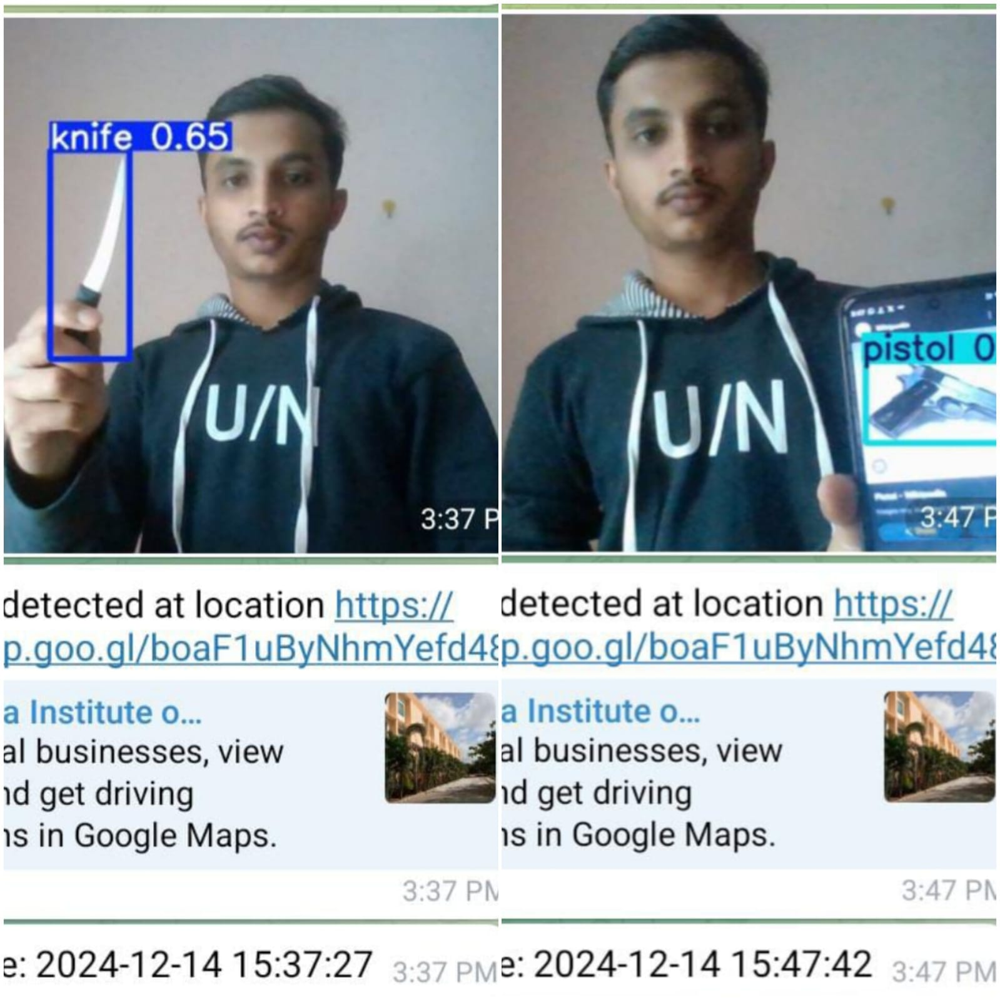
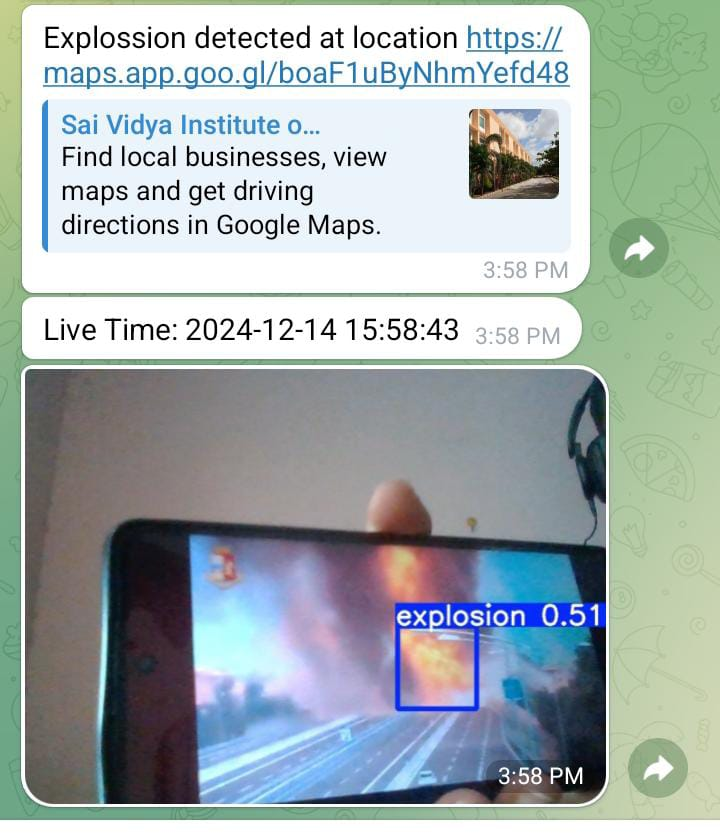
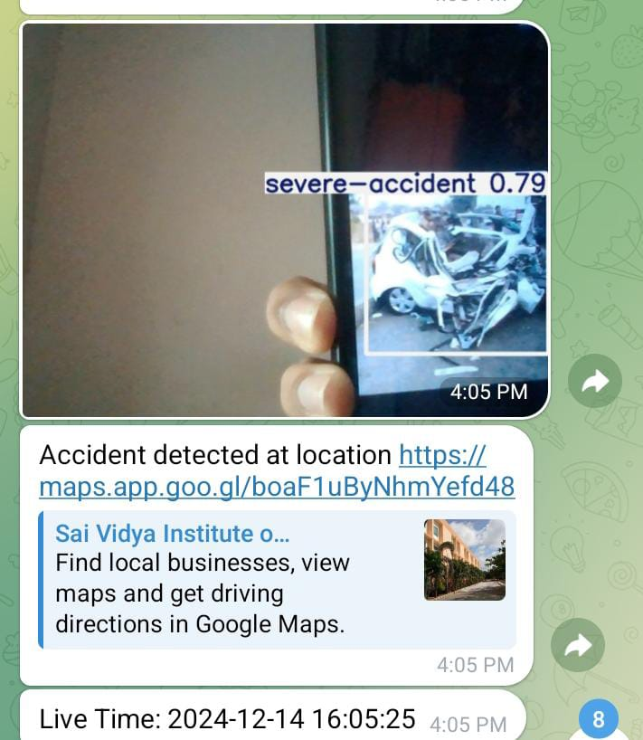
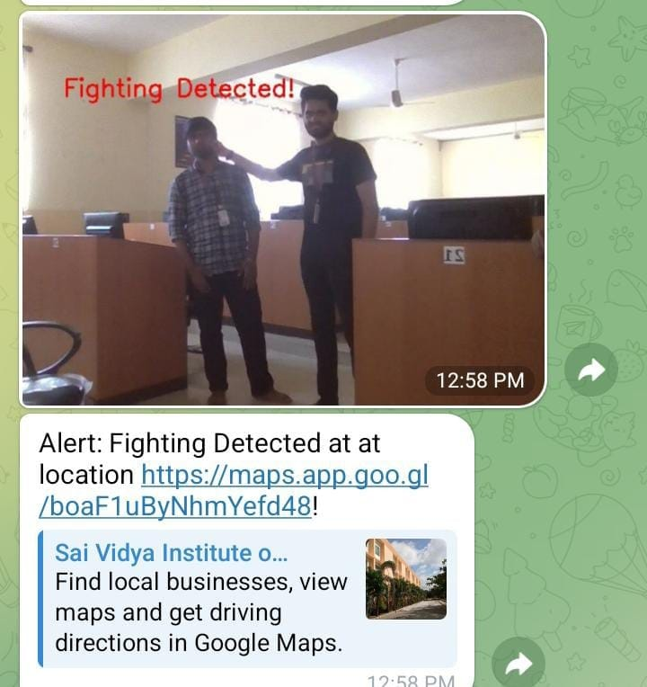

# SmartVision: AI-Powered System for Real-Time Monitoring and Detection of Human Suspicious Activity

## Overview
SmartVision is an advanced AI-powered security system designed to enhance safety in both public and private spaces. By leveraging deep learning and computer vision techniques, SmartVision provides real-time monitoring and detection of suspicious human activities, including weapons detection, accidents, and aggressive behavior.

## Features
- **Real-Time Threat Detection**: Uses YOLOv5 for identifying significant threats like guns, explosives, and accidents.
- **Human Pose Estimation**: Integrates MediaPipe to analyze body movements and detect aggressive behavior.
- **High Accuracy**: Frame-by-frame analysis ensures accurate detection of suspicious activities.
- **Instant Alert System**: Sends real-time notifications to security authorities.
- **Scalability**: Can be deployed in various environments like schools, transit hubs, and high-risk areas.

## Technologies Used
- **YOLOv5**: Object detection for recognizing weapons, explosives, and other threats.
- **MediaPipe**: Human pose estimation to detect hostile behavior.
- **OpenCV**: Image processing and real-time video analysis.
- **Python**: Primary programming language for implementation.
- **TensorFlow/PyTorch**: Deep learning frameworks for model training and deployment.

## Installation
### Prerequisites
Ensure you have the following installed:
- Python 3.8+
- pip
- Git
- CUDA (for GPU acceleration, optional)

### Setup
1. Clone the repository:
   ```bash
   git clone https://github.com/yourusername/SmartVision.git
   cd SmartVision
   ```
2. Create a virtual environment:
   ```bash
   python -m venv venv
   source venv/bin/activate  # On Windows: venv\Scripts\activate
   ```
3. Install dependencies:
   ```bash
   pip install -r requirements.txt
   ```

## Usage
1. Run the system:
   ```bash
   python main.py
   ```
2. To process a video file:
   ```bash
   python detect.py --source path/to/video.mp4
   ```
3. To process live camera feed:
   ```bash
   python detect.py --source 0  # 0 for default webcam
   ```

## Project Structure
```
SmartVision/
│── models/                 # Pre-trained models (YOLOv5, MediaPipe)
│── src/                    # Source code
│   ├── detection.py         # YOLOv5 integration for object detection
│   ├── pose_estimation.py   # MediaPipe integration for pose detection
│   ├── alert_system.py      # Alert system for notifications
│── datasets/                # Training data
│── requirements.txt         # Dependencies
│── README.md                # Documentation
│── main.py                  # Main application entry point
```

## Results






## Contributing
1. Fork the repository.
2. Create a new branch:
   ```bash
   git checkout -b feature-branch
   ```
3. Make your changes and commit:
   ```bash
   git commit -m "Add new feature"
   ```
4. Push to your branch:
   ```bash
   git push origin feature-branch
   ```
5. Create a pull request.


---
SmartVision aims to revolutionize modern security frameworks by integrating cutting-edge AI with real-time response mechanisms, enhancing situational awareness and public safety.

